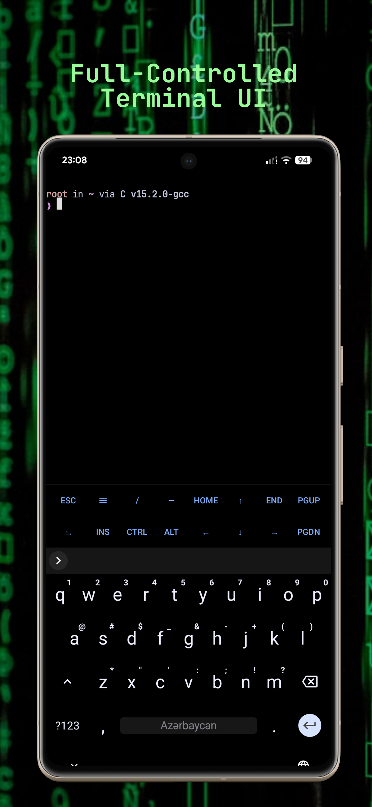
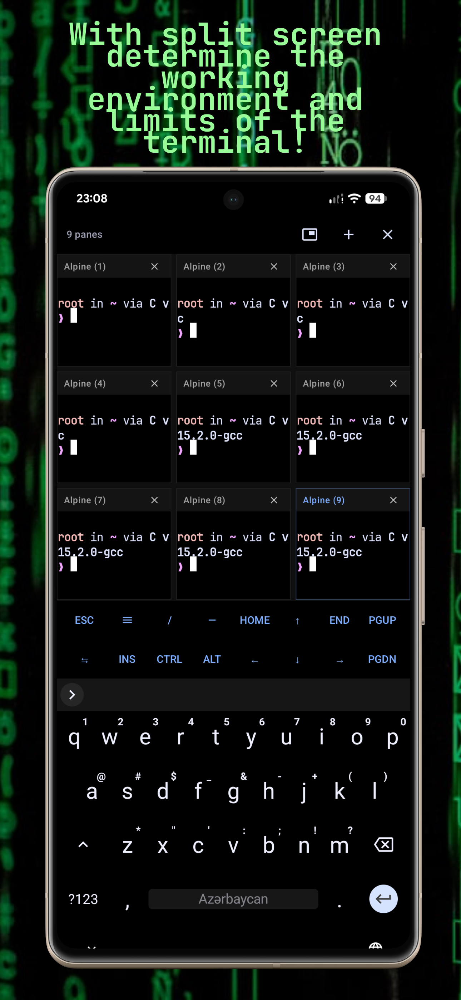
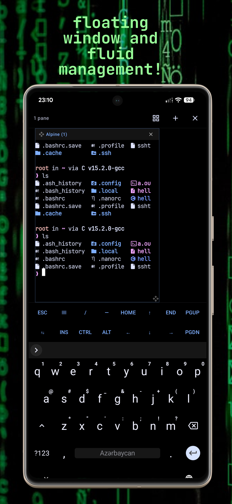
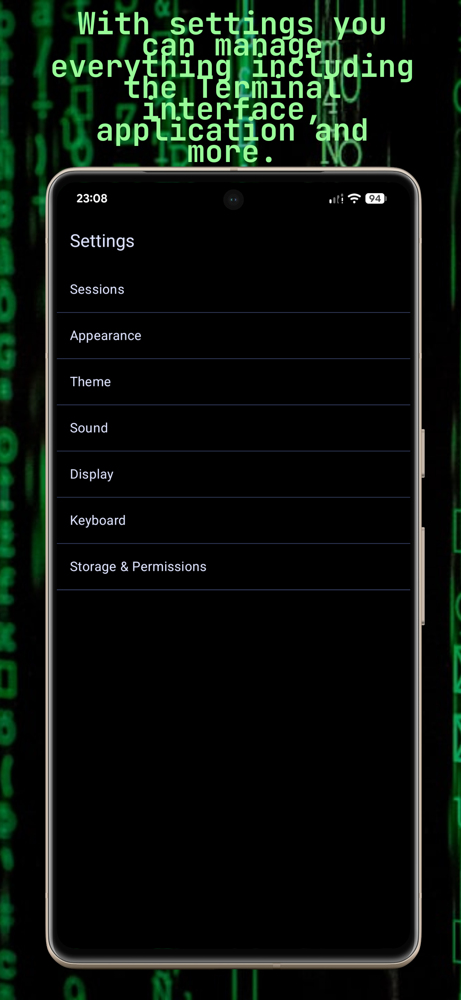
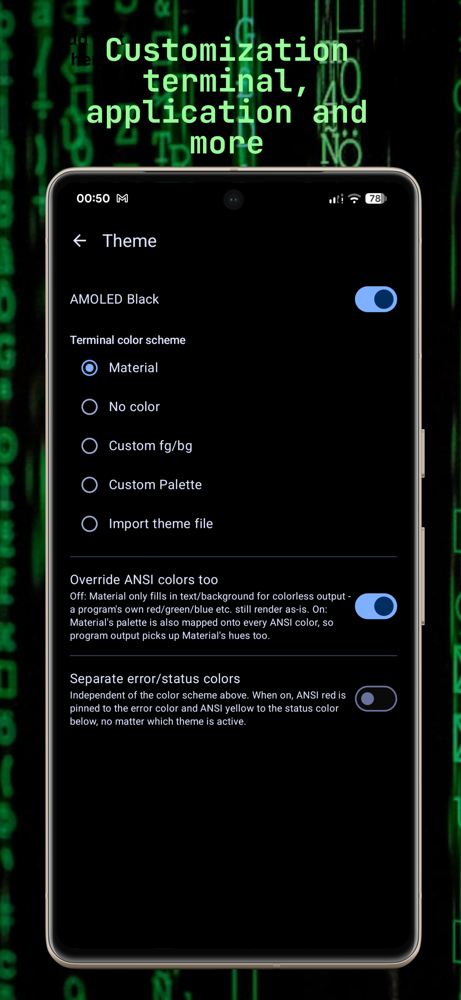

# TERMINATOR

Terminator is Terminal emulator, it offers comprehensive terminal emulator support with multi-session support that you can directly customize and control. Its main purpose is a terminal emulation that can only be read by the user and is suitable for daily use. The main difference from Terminator is only in the Interface area. It comes with embedded terminal colors and a completely compact interface. It does not offer a ready-made chroot proot envormient support, the terminal tool infrastructure and other works are left to the users of the Terminator application. Other terminal environment and terminal user interface are modern. Supports on Android.

## Features

It comes with the material user interface, supports all color mappings and the terminal implements it in its own color interface.

There is Amoled black support and also dynamic color material support in the terminal. If you want to keep it simple or plain just enter the rgb color code and custom css terminal color support is also offered. It comes with support for color palettes including the following color themes: default, solarized dark, gruvbox dark, dracula, nord. But you can configure the palettes yourself. Termcolor and CSS color support is also offered.
[Terminator-themes](https://github.com/8dmusichannels-star/terminator-themes) is a repo containing examples of custom themes and palettes used for Terminal emulator.
.

There is multi-session support, you can create multiple sessions, choose default or favorite. After adding the session there is support for file base session or command arg session. In the session command arg, you directly specify the executable that should be built. If you are using root, you can directly activate the root session without using /system/bin/su, specify the login path and the directory path that will create the startup directory, and start the terminal through the session you have set as the default. The file-based method is the same. By specifying the shell script file name and path as follows, you can directly specify the directory to be created and run it with the login path and by activating the root session. But if you specify a chroot or proot-like environment as an argument, the starting directory may not work. It is only valid for arguments that support entry path. There is a purge setting in clear, which has terminal behavior. In this way, you can determine whether the old data remaining in the clear terminal pty buffer is actually cleared or not! The validity of chroot in proot-like environments is variable.

Resizing the terminal size based on text size, terminal width, or temporary session zoom is supported. Alpha is supported with terminal background support and background blur. It has font support, monospace sans mono serif, mono embedded fonts are available and there is custom font support, you can add ttf otf supported fonts. and you can also control whether the terminal screen zoom support will be on or off with pinch to zoom. It is turned on by default.

Ringtone is supported, you can choose it as custom or default notification sound in the system.

You can hide or show the status bar and title bar on the screen. Horizontal terrain mode is supported. You can also use the terminal in this way. You can export the terminal session as txt and determine whether the save button appears in the bar or not. By managing with the split screen visibility switch toggle, you can turn off and on the buttons that enable split screen and float screen switching. If you turn it on with the broadcast to all panes toggle, you can enter all texts in split screen and float screen mode, commands or text in more than one terminal session at the same time. You can also manage all clear sessions with the toggle and hide the button when it is closed, but clear all sessions when it is open.

As keyboards, soft keyboard (tap to open/close terminal) and virtual key (as keybar) are supported. As login mode:

- **default** — compatible with ALL IMEs including cjk button solid terminal
- **semantically correct** but may break some IMEs
- **Old workaround** — Fixes Samsung keyboard echo: Could break Gboard
- **cjk input** is supported but default is recommended.

3 types of terminal types are supported:

- **xterm256-color** — recommended
- **VT100** — color support is limited and won't work even without terminfo entry
- **ANSI** — color support, but compatible with DOS.

You can control whether the soft keyboard will be on or off with the toggle. With the virtual keybar toggle, you can control whether the virtual keybar will appear or not. With the keyboard shortcust keymapper toggle, you can control whether the keyboard shortcust keymapper buttons will appear or not.
Keyboard shortcuts and keymapper support are also provided. You can assign or support virtual keyboards directly from the physical keyboard. Additionally, seccomp support is available to resolve operation-disallowed errors. and there are more features

## Development status

It is currently under development, more advanced features or improved features will be developed soon, but since it is in beta phase and not fully stable, there may be minor bugs.

## Showcase

# Support and Donate

If you want to contribute to development:

[Support and Donate](https://www.patreon.com/Azccriminal)

[Contributed](https://github.com/8dmusichannels-star/terminator/pulls)
